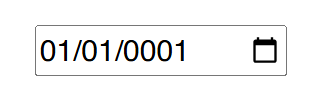

# Blazor Puzzle #67

## Date Input Woes!

YouTube Video: https://youtu.be/

Blazor Puzzle Home Page: https://blazorpuzzle.com

### The Challenge:

This is a .NET 9 Blazor Web App with Global Server Interactivity.

Below is a simple HTML date input field bound to a local DateTime variable.

Click on the month and start typing the date "02/21/2025".

Notice that as soon as you type the first zero, the entire date defaults to 01/01/0001 which renders the dropdown calendar completely useless.

How can this be fixed?

