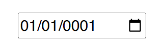
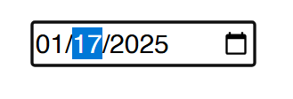

# Blazor Puzzle #67

## Date Input Woes!

YouTube Video: https://youtu.be/

Blazor Puzzle Home Page: https://blazorpuzzle.com

### The Challenge:

This is a .NET 9 Blazor Web App with Global Server Interactivity.

Below is a simple HTML date input field bound to a local DateTime variable.

Click on the month and start typing the date "02/21/2025".

Notice that as soon as type the first zero, the entire date defaults to 01/01/0001, which renders the dropdown calendar completely useless.



How can this be fixed?

### The Solution:

The easiest solution is to replace the input control with an `<InputDate>` control.

Change this

```xml
<input type="date" @bind="@MyDate" />
```

to this:

```xml
<InputDate @bind-Value="@MyDate" />
```

`<InputDate>` is a component built-in to Blazor that interacts with the `<EditForm>` component and also improves upon the base `<input>` tag. 

Note that the binding syntax is different, and we don't need the `type="date"` attribute.



Boom!
